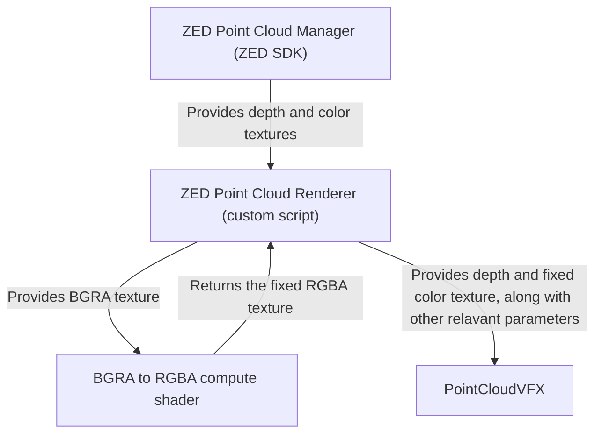

# Unity ZED 2i VFX PointCloud
Simple project to show the very basic implementation of PointCloud with Unity's VFX using the ZED camera SDK.

# How it works?

Step 1: By changing the ZEDPointCloudManager script, to expose private properties:
- Texture2D XYZTexture
- Texture2D colorTexture
we now get access to the color and position of every individual point.

Step 2: We now need to find a way to correctly paint and position each individual particle in the VFX graph. By using blocks that set Position and Color from an Attribute Map with a **Random Constant per Particle**, we can do just that. Since the seed is the same for both blocks, the Random Constant will always correctly target the very same particle in color and position map alike:

Step 3: We now just need to feed both textures into the exposed property field (via a script) and set the particle rate (particles per second) and particle size. This step is very straightforward.

Extra Step: Since ZED camera uses the GRBA color scheme instead the classic RGBA, we need to also implement some way to switch the R and G channels. I've found that the simplest way to do so is by using a custom *ComputeShader*.

For additional questions or findings you can always reach out to me on discord: macraft

